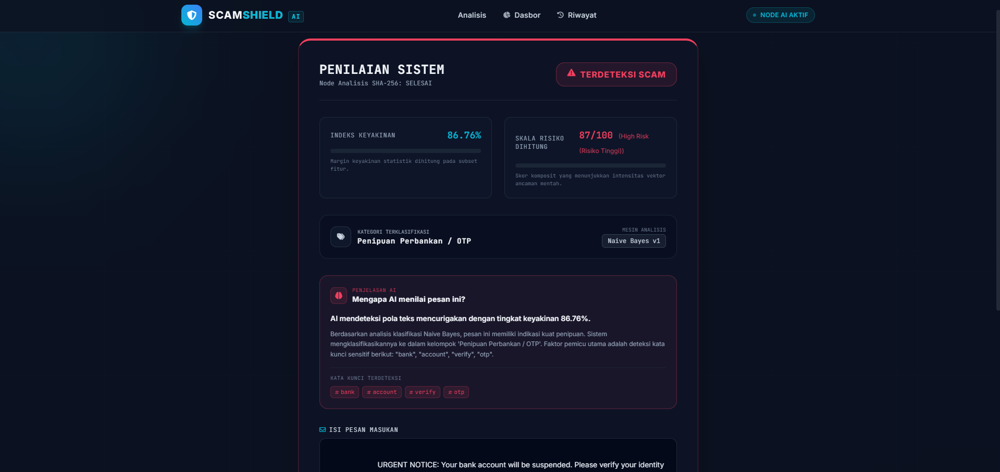
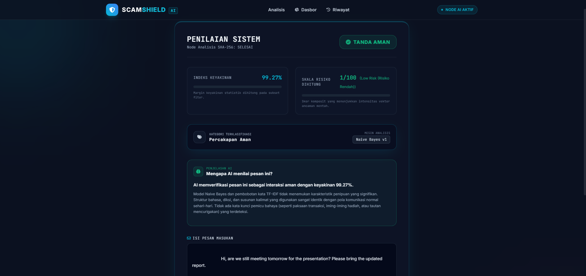
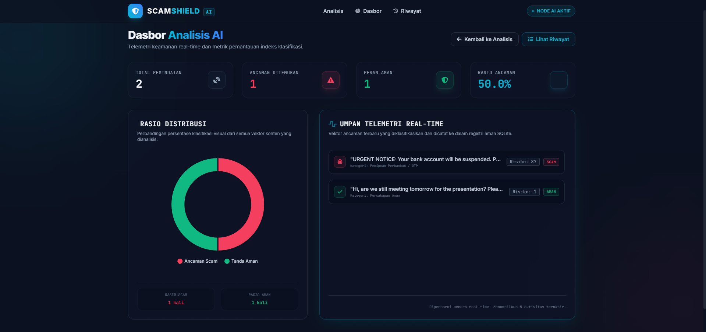
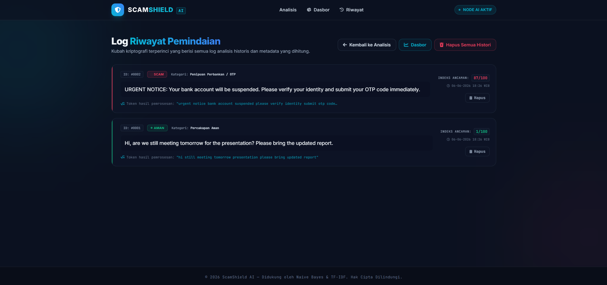

# ScamShield AI 🛡️

ScamShield AI adalah sistem pendeteksi pesan penipuan (**scam detection**) berbasis **Artificial Intelligence (AI)** yang mampu mengklasifikasikan pesan menjadi:

* **SCAM ⚠️**
* **SAFE ✅**

Sistem ini dibangun menggunakan **Natural Language Processing (NLP)** dan **Machine Learning (Naive Bayes)** untuk membantu mendeteksi pola bahasa yang sering digunakan pada pesan penipuan seperti phishing, OTP, hadiah palsu, penipuan bank, QRIS, pinjaman online, dan lainnya.

---

## ✨ Fitur Utama

* 🔍 **Deteksi Scam / Safe** secara otomatis
* 🤖 **AI Prediction** menggunakan Machine Learning
* 📊 **Confidence Score (%)**
* ⚠️ **Risk Score & Risk Level**
* 🏷️ **Kategori Scam**
* 📝 **Riwayat Analisis**
* 📈 **Dashboard Statistik**
* 🌙 **Modern UI (TailwindCSS)**

---

## 🧠 Teknologi yang Digunakan

### Backend

* Python
* Flask
* SQLite
* SQLAlchemy
* Scikit-learn
* Joblib
* NLTK
* Pandas

### Frontend

* HTML
* TailwindCSS
* JavaScript
* Chart.js

---

## 🧩 Implementasi AI

### Natural Language Processing (NLP)

NLP digunakan untuk memahami, membersihkan, dan memproses pesan teks sebelum dilakukan analisis.

Tahapan preprocessing:

* Lowercase Text
* Text Cleaning
* Tokenization
* Stopword Removal

Contoh:

**Sebelum:**

```txt
SELAMAT!!! Anda memenangkan hadiah Rp100 juta
```

**Sesudah:**

```txt
selamat memenangkan hadiah
```

Tujuan preprocessing adalah membantu sistem memahami pola bahasa pada pesan scam secara lebih akurat.

---

### Machine Learning (ML)

Machine Learning digunakan agar sistem mampu mempelajari pola pesan **scam** dan **safe** berdasarkan dataset training.

Model yang digunakan:

* **TF-IDF Vectorizer**
* **Multinomial Naive Bayes**

Alur kerja AI:

```txt
Input Pesan
↓
Preprocessing NLP
↓
TF-IDF Vectorization
↓
Naive Bayes Classification
↓
Risk Analysis
↓
Hasil Prediksi
```

---

## 📂 Struktur Project

```txt
scamshield-ai/
│
├── app.py
├── config.py
├── requirements.txt
│
├── database/
│   └── models.py
│
├── dataset/
│   ├── spam.csv
│   ├── dataset_sms_spam_v1.csv
│   └── spam_dataset.csv
│
├── model/
│   ├── train_model.py
│   └── predictor.py
│
├── utils/
│   ├── preprocessing.py
│   └── risk_analyzer.py
│
├── saved_model/
│   ├── model.pkl
│   └── vectorizer.pkl
│
├── static/
├── templates/
└── assets/
```

---

## 📸 Tampilan Website

### Halaman Utama


### Hasil Deteksi Scam



### Hasil Deteksi Safe



### Dashboard Analytics



### Riwayat Analisis



---

## 🚀 Cara Menjalankan Project

### 1. Clone Repository

```bash
git clone https://github.com/USERNAME/scamshield-ai.git
```

### 2. Masuk Folder Project

```bash
cd scamshield-ai
```

### 3. Install Dependency

```bash
pip install -r requirements.txt
```

### 4. Jalankan Website

```bash
python app.py
```

Buka browser:

```txt
http://127.0.0.1:5000
```

---

## 🎯 Tujuan Project

Project ini dibuat sebagai implementasi **Artificial Intelligence pada deteksi pesan penipuan digital**, dengan fokus pada:

* Scam SMS
* Phishing
* Penipuan OTP
* Penipuan Perbankan
* Penipuan Hadiah
* Link Berbahaya
* Scam Marketplace & E-wallet

---

## 👨‍💻 Developer

**Xiao Di**